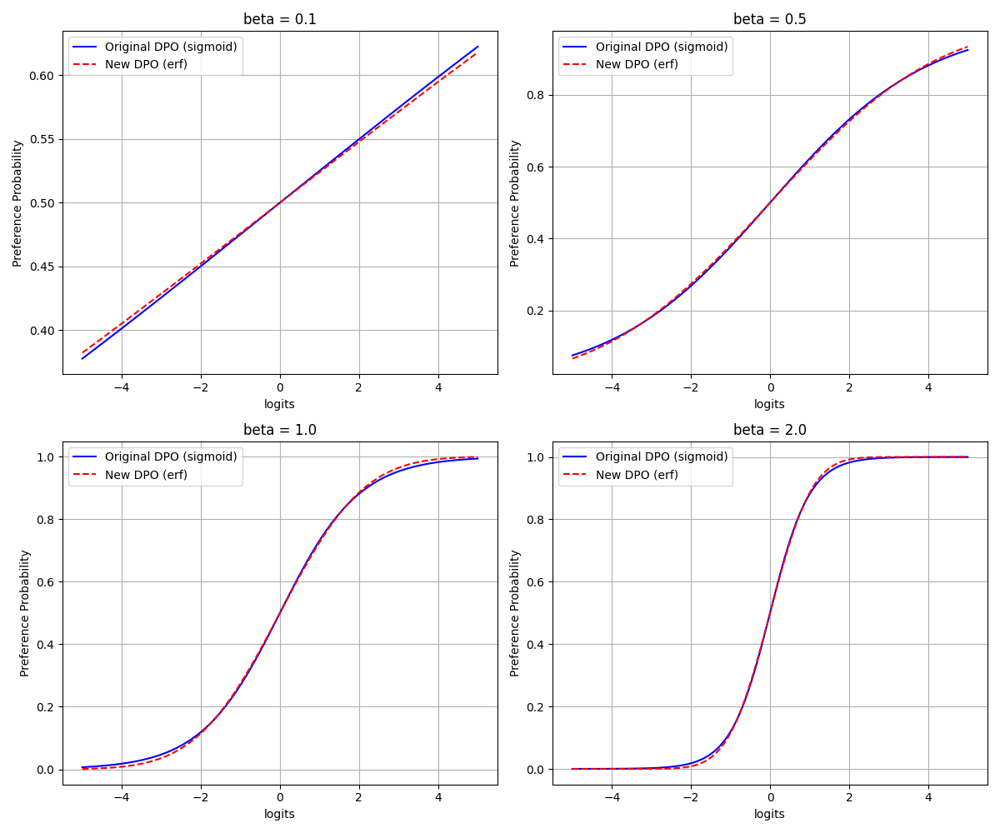

# README

这个算法是基于DPO算法，但是做了一些改进，主要改进点在于：Reward Model 的输出是一个随机变量, 而不是一个确定值。

## 算法原理

$$r(x, y) \sim N(\mu(x, y), \sigma(x, y))$$ 

其中，$r(x, y)$ 是 Reward Model 的输出，$\mu(x, y)$ 和 $\sigma(x, y)$ 是均值和方差。为了简单起见, 我们假设 $\sigma(x, y)$ 是一个常数 1.0。

那么偏好概率的计算方式为:

$$p(y_w > y_l) = \frac{1}{2} \left(1 + \text{erf}\left(\frac{\mu(x, y_w) - \mu(x, y_l)}{\sqrt{2}}\right)\right)$$

## DPO vs Disco-DPO

### 1. 原始 DPO 的偏好概率（基于 sigmoid 函数）
在原始的 Direct Preference Optimization (DPO) 中，偏好概率是通过 sigmoid 函数计算的。公式如下：

\[
p_{\text{original}} = \sigma(\beta \cdot \text{logits})
\]

展开 sigmoid 函数的定义：

\[
p_{\text{original}} = \frac{1}{1 + e^{-\beta \cdot \text{logits}}}
\]

#### 参数说明：
-  $\beta \cdot \text{logits}$ 是两个 response $r(x, y_w)$ 和 $r(x, y_l)$ 的奖励差异
- \(\text{logits}\)：策略模型和参考模型的对数概率比的差异，通常定义为：
  \[
  \text{logits} = (\log \pi(y_w | x) - \log \pi(y_l | x)) - (\log \pi_{\text{ref}}(y_w | x) - \log \pi_{\text{ref}}(y_l | x))
  \]
  其中：
  - \(\pi(y_w | x)\) 和 \(\pi(y_l | x)\) 是策略模型对“获胜”响应 \(y_w\) 和“落败”响应 \(y_l\) 的概率；
  - \(\pi_{\text{ref}}(y_w | x)\) 和 \(\pi_{\text{ref}}(y_l | x)\) 是参考模型的概率。
- \(\beta\)：温度参数（超参数），控制曲线的陡峭程度，典型值在 0.1 到 0.5 之间，但在我们的例子中可以取任意正值。
- \(e\)：自然对数的底，约等于 2.71828。

#### 特点：
- 当 \(\text{logits} \to +\infty\) 时，\(p_{\text{original}} \to 1\)；
- 当 \(\text{logits} \to -\infty\) 时，\(p_{\text{original}} \to 0\)；
- 当 \(\text{logits} = 0\) 时，\(p_{\text{original}} = 0.5\)。

---

### 2. 改进后的偏好概率（基于 erf 函数）
在你改进后的版本中，偏好概率基于 Reward Model 输出为正态分布随机变量的假设，计算方式使用误差函数 (erf)。公式如下：

\[
p_{\text{new}} = \frac{1}{2} \left(1 + \text{erf}\left(\frac{\beta \cdot \text{logits}}{\sqrt{2}}\right)\right)
\]

其中，$\text{erf}(x)$：误差函数，定义为：
  \[
  \text{erf}(x) = \frac{2}{\sqrt{\pi}} \int_{0}^{x} e^{-t^2} \, dt
  \]
  它是对高斯分布的累积分布函数的一种形式，值域为 \([-1, 1]\)。

#### 参数说明：
- $\beta \cdot \text{logits}$ 是两个 response $r(x, y_w)$ 和 $r(x, y_l)$ 的奖励差异随机变量, 我们假设其方差为 1.0

#### 特点：
- 当 \(\text{logits} \to +\infty\) 时，\(\text{erf} \to 1\)，\(p_{\text{new}} \to 1\)；
- 当 \(\text{logits} \to -\infty\) 时，\(\text{erf} \to -1\)，\(p_{\text{new}} \to 0\)；
- 当 \(\text{logits} = 0\) 时，\(\text{erf}(0) = 0\)，\(p_{\text{new}} = 0.5\)。

---

### 数学公式的总结

1. **原始 DPO（sigmoid）**：
   \[
   p_{\text{original}} = \frac{1}{1 + e^{-\beta \cdot \text{logits}}}
   \]

2. **改进后的 DPO（erf）**：
   \[
   p_{\text{new}} = \frac{1}{2} \left(1 + \text{erf}\left(\frac{\beta \cdot \text{logits}}{\sqrt{2}}\right)\right)
   \]

- 这两个公式都以 \(\text{logits}\) 为输入，输出介于 0 和 1 的概率。
- \(\beta\) 在两种公式中都起到缩放作用，但由于底层函数不同（指数 vs 高斯），它们对 \(\beta\) 的敏感性有所差异。
- 如果你需要更详细的推导（例如 \(\text{logits}\) 如何与 \(\mu_w - \mu_l\) 对齐），可以告诉我，我会进一步展开！

